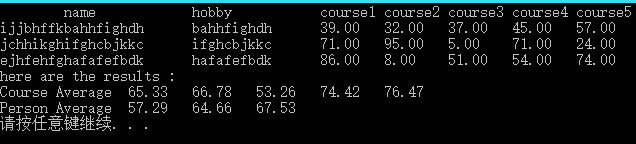

##作业提交
####代码结构
```
根据题目，设计结构体如下：
struct Student
{
    char name[LENGTH_NAME];
    char hobby[LENGTH_HOBBY];
    float score[LENGTH_COURSE];
} studentmsg[LENGTH_PERSON];
学生姓名和爱好长度可以调整，课程数量和学生数量也可以按需调整

函数设计为3个，分别负责生成随机数据、显示数据、处理数据并简单显示
int StudentGenerate();
int StudentDisplay();
int GradeAverage();


```

####运行效果

####改变课程数、人数效果


####编译与调试过程
```
1.character constant too long for its type把“”打成了‘’  
  passing argument 1 of 'printf' makes pointer from integer without a cast和上一条错在同一处
2.Segmentation Fault  打印字符数组时格式错误l
```
