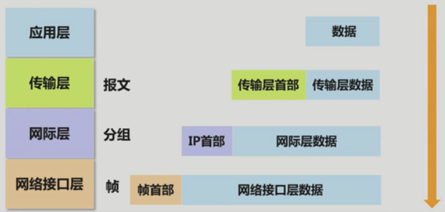

[TOC]

---

## 第1讲 概论

### 1.1 网络内涵

1. 网络特征：
   1. 共享资源：互连计算机的目的是实现资源共享
   2. 自治系统：能够独立运行并提供服务的系统，连接到计算机网络中的每个设备都应该是自治系统
   3. 遵循统一的通信标准
2. 计算机网络：以实现资源共享为目的，一些互相连接的、独立自治的计算机的集合

### 1.2 互联网发展过程

1. 接入网：

   1. 拨号上网（20世纪90年代初：PSTN）

      上行速率为33.6kbps，下行速率为56kbps

   2. ADSL（20世纪90年代末）

      上行32kbps或64kbps，下行为1Mbps或2Mbps

   3. 以太网（20世纪90年代末）

      10Mbps→100Mbps

2. 主干网：

   1. 数字数据网（Digital Data Network，DDN）

      2.048Mbps→8Mbps→34Mbps→115Mbps

   2. 异步传输模式（Asynchronous Transfer Mode，ATM）

      155Mbps→622Mbps

   3. 同步数字体系（Synchronous Digital Hierarchy，SDH）

      2.5Gbps→10Gbps

3. 统一网络：

   网络有PSTN电话网络、只传输数据的数据网络、有线电视网络

   统一网络是同时可以实现语音、视频和数据传输的数据网络

   统一网络要求很高的实时性和同步性

4. 物联网

5. 网络安全

### 1.3 交换方式

#### 1.3.1 电路交换

1. 交换技术分为电路交换和分组交换

2. 交换的本质含义

   网络的目标是实现网络上终端之间的数据通信

   1. 建立连接在网络上的任何两个终端之间的数据传输通路的机制
   2. 控制数据沿着源终端至目的终端传输通路完成传输过程的机制

3. 信道就是信号的传输通道

4. 电路交换过程：由交换机按需在两个终端之间动态建立信道的过程，也称为连接建立过程

   电路交换方式：两个终端之间的信道建立方式

5. 建立数据传输通路的机制：建立连接、释放连接

   PSTN是典型的电路交换网络，拨号是建立连接，挂机就是释放连接，建立的连接是独享的

6. 电路交换的缺点：

   - 独占两个终端间的信道，导致信道经过的物理链路利用率低
   - 不能保证多对终端间同时通信
   - 信道经过的物理链路要求相同的传输速率，物理链路的连接方式受到严格限制

#### 1.3.2 虚电路交换

1. 物理链路共享是解决电路交换缺点的方法，但是有如下问题：

   1. 交换机如何转发数据的问题，怎么分辨终端同时传来的数据，又怎么分发
   2. 平滑流量问题，几对终端间传输的数据量必须小于交换机间能传输的量，不然可能拥塞

2. 解决物理链路共享问题的方法：

   1. 标识符和分组

      数据标识符：对每一对终端之间传输的数据分配唯一的标识符

      分组：数据和标识符同时进行传输的数据格式

   2. 转发表（交换机内部）

      建立不同终端对之间的传输路径，并将数据标识符与传输路径绑在一起。

   3. 存储转发

      交换机里设计一个输入输出队列，用于存储转发

3. 虚电路含义

   虚电路是指一对终端间的传输路径，该传输路径通过转发表建立，并与唯一标识该终端之间传输的数据的标识符绑定

#### 1.3.3 数据报交换

1. 虚交换电路缺陷：

   动态建立虚电路会导致传输时延长

   事先建好虚电路会导致处理时间长、存储空间要求加大

2. 数据报的数据传输路径建立机制：

   - 虚电路标识符改为每个终端地址
   - 每一对终端之间传输路径改为指向终端的传输路径

   这时，分组被修改为数据|源地址|目的地址，原来虚电路时为数据|标识符

3. 数据报分组交换，简称数据报交换，特征为：

   - 为终端分配地址，修改分组格式
   - 转发表中的转发项给出通往每一个终端的传输路径
   - 以分组目的地址查找转发表，确定分组转发端口

4. 优点：均衡网络负载（根据多个路径端口传来的数据来选延迟低的）、容错性好（路径不单一）

   数据报交换是现代网络的技术基础

### 1.4 计算机网络体系结构和协议
#### 1.4.1 网络体系结构和协议

1. 对等层：在两端分层结构中处于同一地位，起相同作用的功能层

   实体：真正完成所处层功能的硬件和软件集合

   协议：两端对等层之间的约定和规范（三个要素）

   - 语法规定了相互交换信息的结构和格式
   - 语义规定了相互交换的信息种类，接收方应该做出如何反应
   - 时序规定了各个事件的发生顺序

2. 网络体系结构是分层结构和协议的集合

#### 1.4.2 OSI体系结构（开放系统互连/参考模型）

1. OSI网络环境：

   互连方式：

   终端与分组交换机之间直接用物理链路连接

   分组交换机之间用物理链路连接

   允许多点接入（多个终端接在分组交换机的一个端口）

   交换方式：所有交换机的交换方式是相同的

2. 各层功能：

   数据链路层：差错控制、将待传输数据封装成分组

   网络层：核心功能是路由，即为分组选择正确传输路径

   传输层：实现进程间通信，数据携带进程标识符

   会话层：管理两个进程间会话的过程，比如断点续传

   表示层：统一通信双方描述传输信息所使用的语义和语法

   应用层：定义某个应用的消息格式和实现过程

3. 数据传输过程中的两个概念：

   协议数据单元(Protocol Data Unit,PDU)：对等层传输的数据单位

   服务数据单元(Service Data Unit,SDU)：上层协议数据单元交给下层时作为下层的服务数据单元

4. OSI体系结构的特点：

   分层结构，基于**特定网络环境**定义每一层的功能

   每一层**只定义了功能**，没有系统定制对等层之间的协议

   每一层的封装信息也没有具体意义

   没有真正基于OSI体系结构的实际网络

5. OSI体系结构的作用：

   分层结构和每一层的功能为网络设计和实现提供了依据

   分层结构和每一层的功能为学习和理解网络提供了思路

#### 1.4.3 TCP/IP体系结构

1. TCP/IP体系结构网络环境：

   实现同一网络终端之间的通信过程

   实现不同网络终端之间的通信过程

   OSI体系结构是单一的网络环境。所以TCP/IP体系结构分为网络接口层、网际层、传输层、应用层，没有对物理层和链路层进行细分（过于复杂）

2. TCP/IP体系结构各层功能：

   - 网络接口层：（高明之处）

     将IP分组封装成适合通过该网络传输的帧格式

     不同类型的网络有着不同的网络接口层，有着相应的网络接口层协议

   - 网际层：实现连接在不同类型网络上的两个终端之间的通信过程

   - 传输层：功能与OSI中的类似，但增加了差错控制和拥塞控制功能

   - 应用层：包含OSI中应用层、表示层、会话层的功能

3. 数据封装过程

   

   每一层在上一层基础上加上自己的部分
## 第2讲 数据通信基础
### 2.1 数据传输系统
#### 2.1.1 数据传输系统

1. 数据传输系统：实现由物理链路互连的两个结点之间数据传输过程的系统，是最基本的数据传输单元

   组成：由结点、收发器和信道组成，结点可以是终端、服务器和交换机等设备

2. 信道连接结点方式：根据同一信道连接设备的多少可以把信道连接设备的方式分为点对点连接方式和多点连接方式，相应的信道为点对点信道（当今主要）和广播信道

   > 剩余内容和第2、3节内容为信号与系统、数字信号处理、通信原理中的一些最基础常识，不录入了

### 2.4 差错控制

#### 2.4.1 检错码

1. 检验和：

   - 将数据分为长度固定（一般是字节的整数倍）的数据段

   - 根据反码运算规则累加分段后产生的每一段数据

   - 将累加结果取反作为检错码

   - 数据的累加和和检验和之和应该是全1

   在应对多段数据出错时存在缺陷

2. 循环冗余检验码：

   - 假定传输的数据为M(x)=11000011

   - 找到除数G(x)=10011,G(x)最高位(2^4^)指数为r=4

   - 11000011x2^r^=110000110000

   - 110000110000/10011得到的余数R

     检错过程：接收数据(M(x)'x2^r^-R)/G(x)，整除即为正确

#### 2.4.2 确认和重传

1. 确认应答：发送端判别数据是否被正确接收
2. 重传：出错数据必须重新发送
3. 序号：避免接收端重复接收数据

#### 2.5 传输媒体

1. 传输媒体也称传输介质或传输媒介，用于构成数据传输系统中两个收发器之间的信道，分为导向传输媒体（同轴电缆、双绞线、光纤）和非导向传输媒体（自由空间）

2. 同轴电缆中心导体和外导体屏蔽层之间的绝缘层是确保中心导体和外道提屏蔽层间距离始终如一，但是也导致了线缆变硬

   细同轴电缆使用时截断后加上BNC接头或T字头就可以用来连接

3. 双绞线由两根具有保护绝缘层的铜导线组成,分为外部有铝箔屏蔽的屏蔽双绞线和非屏蔽双绞线.

   常用双绞线有5类(100Mb/s)和5e\6类(1Gb/s)

4. 多模光纤纤芯直径大,多束光线传播,发送端发光体为发光二极管,传输距离小于250m.单模光纤的直径接近一个光波波长,只有单束光线传播,发送端发光体为激光器,传输距离10-80km

5. 双绞线和光纤互补性很强,是主流传输媒体,同轴电缆在通信中逐渐被淘汰,这些线缆的使用催生了综合布线行当

   

> 2.6介绍了cisco出的packet tracer6.2软件,功能非常全面、专业

## 第3讲 以太网

1. 以太网是当今最流行的局域网技术
2. 以太网的发展过程：
   1. 传输媒体从采用同轴电缆到双绞线缆和光纤
   2. 从共享式以太网（总线式以太网）到交换式以太网
   3. 出现VLAN和三层交换技术
   4. 从低速以太网发展到高速以太网
3. 交换式以太网导致了大量的MAC帧在以太网中广播，所以出现了VLAN技术，每一个VLAN在逻辑上说是一个独立的网络，所以两个VLAN间通信要路由器。三层交换机是集路由器路由和交换功能为一体的以太网交换机，解决了以太网VLAN划分和VLAN内部通信问题

### 3.1 总线形以太网

#### 3.1.1 总线形以太网基础

1. 总线形以太网拓扑结构：终端在往总线上发送信号的时候会沿总线向两边传输，为了防止总线两端的反射信号，在总线两端接上匹配阻抗，就可以方便的使用BNC接头连接
2. 总线形以太网功能需求:数据与信号转换、数据封装、帧对界、检测总线状态、公平竞争总线、寻址
3. 基于以太网的TCP/IP体系结构中，把以太网分成MAC层和物理层，分别解决上面的问题。物理层解决帧对界、数据与信号转换、检测总线状态，MAC解决数据封装、公平竞争总线、寻址

#### 3.1.2 基带传输与曼彻斯特编码

1. 总线形以太网的物理层实现是基带传输，曼彻斯特编码是为了方便同步发送端和接收端时钟，且方便检测总线状态，但是曼彻斯特码把一个码元变成了两个，所以浪费带宽，在速率要求100Mbps以上时不再使用

#### 3.1.3 数据封装格式：MAC帧

1. MAC地址实际上是网卡地址，是全球唯一的，由6个字节48个二进制位组成

2. 一个终端可以给另一个终端发送信息，或者给多个，或者给总线上所有终端，因此有了单播地址，组播地址，广播地址

   MAC地址最后１位制成０表示单播地址，１表示组播地址,整个48位全部置1,就是广播地址

3. MAC帧格式:目的地址-源地址-类型-数据-检错码，数据部分称为MAC的净荷字段，长度46-1500个字节

4. MAC层为了帮助物理层实现帧对界，在MAC帧前面加上一个先导码和帧开始分界符，先导码10101010，帧开始分界符是10101011

#### 3.1.4 CSMA/CD算法

1. CSMA/CD算法是为了终端公平竞争总线而设计的一种算法
2. 算法缺陷：只适用于轻负荷，捕获效应（旱的旱死），冲突域直径与最短帧长的制约（导致最短帧长在带宽10Mbps下需超过64字节，100Mbps下超过640字节）

### 3.2 网桥与冲突域分割

1. 网桥功能：隔断电信号使不同冲突域间电信号互不干扰、转发MAC帧。所以网桥是一个采用分组交换技术的分组转发设备

   网桥的转发功能是靠的其中的转发表,转发表由网桥根据源地址和端口等信息自行学习

2. 集线器(Hub):是一个多端口中继器,端口支持的传输媒体类型通常为双绞线.集线器仍然是一种共享式的

### 3.3 交换式以太网和VLAN

#### 3.3.1 VLAN与广播域分割

1. 网桥的使用导致了大量的MAC帧以广播的方式在以太网中传播
2. 广播域:整个以太网中的网桥都使用广播,这个MAC帧能遍历的网络范围称为广播域
3. 广播的危害:浪费链路带宽和网桥与终端的处理能力、引发安全问题
4. 划分物理以太网产生的每一个广播域等同于一个逻辑上独立的以太网，由于这些逻辑上独立的以太网存在于同一个物理以太网中，被称为虚拟局域网(Virtual LAN,VLAN)
5. 网桥和以太网交换机细分时的区别：网桥是具有地址学习、MAC帧转发等分组交换功能的设备，以太网交换机是在网桥的基础上增加了VLAN划分及其他一些增强网络性能的功能的设备，简称交换机
6. 交换式以太网：以交换机为分组设备构建的以太网称为交换式以太网

> 该讲余下部分均为交换机和VLAN划分在packet tracer中的操作

## 第4讲 无线局域网

### 4.1 无线局域网概述

#### 4.1.1 无线局域网体系结构

1. 网络接口层比以太网网络接口层所含的物理层、MAC层外多了一个LLC层（逻辑链路控制）

   LLC层：指定数据类型

   MAC层：MAC地址、MAC帧封装、争用无线信道

   物理层：无线信道二进制位流传输功能

2. LLC层：在上一层提供的基础上再加一个数据类型（以太网类型字段，2字节），前面再加6个字节固定值表示无线局域网数据增加的类型

   LLC层帧结构：AA-AA-03-00-00-00-以太网字段类型-数据字段

   这样设计的原因：（以太网有两个标准）

   - DIX(Dec、Intel、Xerox)定义的以太网标准中MAC帧有数据类型

   - IEEE定义的局域网标准的MAC帧无数据类型
   - 以太网用的DIX，无线局域网用的IEEE，所以要另外加一层来加数据类型字段

3. 无线局域网的MAC层和标准的是一样的，但是物理层不太一样，有802.11，802.11b，802.11g，802.11n，802.11a几个标准

   物理层标准的主要区别：电磁波频段、使用的扩频技术、信号调制技术

   前4个标准是兼容的，统称802.11bgn

   | 协议标准 | 电磁波频段 | 数据传输速率（Mbps） |
   | -------- | ---------- | :------------------- |
   | 802.11   | 2.4GHz     | 1、2                 |
   | 802.11b  | 2.4GHz     | 5.5、11              |
   | 802.11g  | 2.4GHz     | 54                   |
   | 802.11n  | 2.4GHz     | 150，300             |
   | 802.11a  | 5GHz       | 54                   |

4. 扩频技术：（涉及公式为RS=BWxlog~2~(1+S/N) RS为最大传输速率）

   - 可以通过提高带宽或者信号的信噪比来提高信道的数据传输速率
   - 在数据传输速率不变的情况下，可以通过提高带宽来降低信号信噪比的需求

   扩频技术：为了提高无线通信的容错性使得无线信道带宽大于实现数据传输速率所要求的带宽的技术

5. 无线信道：802.11bgn把标准2.4GHz频段分成13个信道（国内，美国为11个），相邻信道存在重叠，信道1，6，11间不存在重叠

#### 4.1.2 无线局域网组网方式

1. 无线局域网的最小构成单位是**基本服务集**
   - **基本服务集**中只包含工作站的称为**独立基本服务集(IBSS)**
   - **基本服务集**中包含工作站和AP的称为**基本服务集(BSS)**
   - **基本服务集**所覆盖的地理范围称为**基本服务区(BSA)**

2. 独立基本服务集：

   1. 网络结构：

      传输距离短，最大传输距离100-300米

      IBSS是一个冲突域，终端数量不能太多

      实际的IBSS是由一台终端创建，其他终端加入形成的

   2. MAC帧传输过程：

      每个终端有一个全球唯一的MAC地址（同以太网类似）

      源终端向目的终端发送数据，目的终端正确接收到数据后发送应答帧

      > 应答帧的原因1是无线通信可靠性低，2是隐蔽站问题使发送终端无法检测出冲突

3. 基本服务集：（独立基本服务集只能在同一个服务集中的终端间通信）

   1. 网络结构：BSS中存在称为接入点(AP)的设备，通过AP可以和其他网络实现互连
   2. MAC传输过程：源终端和目的终端可能不再同一个BSS里，但终端无法判断彼此是否在同一个BSS，由AP来判断，同一个BSS中终端间的通信也通过AP来转发。终端与AP间通信也要逐段确认（接收应答），AP间通信一样逐段确认，这种模式称AP-repeated模式

4. 扩展服务集：（真正扩展无线局域网通信范围）

   1. 网络结构：每个基本服务集作为一个个网段，然后通过AP连接到以太网上
   2. MAC帧传输过程：BSS中的部分依然要确认应答，然后AP做MAC帧格式转换，传给以太网不再需要确认应答

5. 无线分布式系统：

   1. 无线网桥类似交换机，同时存在连接无线链路和有线链路的端口
   2. 连接无线链路的端口是虚拟的逻辑端口V2，V3
   3. 转发MAC时逻辑端口等同于连接有线链路的端口
   4. 无线网桥在两种不同类型端口之间MAC帧转发要进行MAC帧格式转换

### 4.2 无线局域网MAC层

#### 4.2.1 无线局域网MAC帧

1. 无线局域网MAC帧控制字段比以太网MAC帧多很多，基本都是为了逐段确认设置的

#### 4.2.2 终端接入无线局域网过程

1. 每一个基本服务集有唯一的标识符，称作基本服务集标识符(BSSID)，一般是AP的MAC地址

   多个基本服务集可以构成一个扩展服务集，每一个扩展服务集有着唯一标识符，称为服务集标识符(SSID)

2. 同一BSS需要确定三组参数：服务集标识符(SSID)，使用的信道，若采用密钥机制还需配置密钥

> 本部分没有录入的全部为细讲具体的各类传输过程及过程中如何使用相关的算法

## 第5讲 IP和网络互连

### 5.1 网络互联机制

1. 网络互连是指能够实现两个连接在不同网络上的终端间通信（如以太网和PSTN），需解决的问题有：地址标识不同（以太网是MAC地址，PSTN是电话号码）、帧格式不同（以太网是MAC帧，PSTN是PPP帧）、无法直接建立传输路径
2. 由路由器来实现不同类型网络互连，路由器需要多个连接不同类型网络的接口，终端与路由器接口之间通信由不同传输网络实现，路由器实现传输路径的选择和两种不同帧格式之间的转换
3. 终端和路由器称为**跳**
4. IP实现网络互连机制：
   - 网络互连的关键是IP，IP核心内容是IP地址和IP分组
   - 结点根据IP分组目的IP地址和路由表确定下一跳IP地址
   - 由传输网络实现IP分组从当前跳到下一跳的传输过程
   - IP分组经过不同的传输网络传输时，需封装成传输网络对应帧格式

### 5.2 网际协议

#### 5.2.1 IP-分类编址

1. 网际协议IP分为IPV4（32位）和IPV6（128位）

   网络号和主机号这样的编址方式称为分层编址，把不同的IP地址分成了不同的类，每一类的网络号和主机号不一样

2. | A类地址 | 0-7位网络号-24位主机号   | 0.0.0.0~127.255.255.255   |
   | ------- | ------------------------ | ------------------------- |
   | B类地址 | 10-14位网络号-16位主机号 | 128.0.0.0~191.255.255.255 |
   | C类地址 | 110-21位网络号-8位主机号 | 192.0.0.0~223.255.255.255 |
   | D类地址 | 1110-组播地址            | 224.0.0.0~239.255.255.255 |
   | E类地址 | 11110-保留               | 240.0.0.0~247.255.255.255 |

   - ABC类称为单播地址，包括网络号和主机号两部分
   - 主机号全0表示网络地址，不能分配给终端使用，有特殊用途
   - 主机号全1表示直接广播地址
   - 32位全1表示受限的广播地址，限于发送终端所在网络
   - 0.0.0.0表示IP地址无法确定，终端没有分配IP地址前，可以作为IP分组的源地址
   - 127.x.x.x是回送测试地址
   - 著名组播地址：224.0.0.1网络中所有支持组播的终端和路由器，224.0.0.2网络中所有支持组播的路由器，224.0.0.9网络中所有运行RIP进程的路由器

3. IP分类主要是为了适应网络规模的不同

   终端数量<=2^8^-2，C类地址，2^8^-2<终端数量<=2^16^-2，B类地址，2^16^-2<终端数量<=2^24^-2，A类地址

#### 5.2.2 IP-无分类编址

1. 分类编址存在：IP地址浪费严重、路由项无法有效精简和C类网络地址使用率较低等问题

   无分类编址就是允许随意改变IP地址中网络号和主机号位数的编址方式

2. 无分类编址通过子网掩码指明IP地址中作为网络号的二进制数

   子网掩码中值为1的二进制数对应的IP地址中作为网络号的二进制数

   例如5.1.1.2/255.0.0.0,后面是子网掩码,可以简写成5.1.1.2/8表示8位网络号,考试中还会涉及把IP地址中低位的连续0省去的写法5.0.0.0/8->5/8

3. 网络前缀+主机号这样的IP地址称为CIDR,无类别域间路由

   CIDR地址块表示的IP地址集合,可以分配给同一网络中的终端,也可以分配给不同网络中的终端.

   可以进一步解决IP地址浪费,精简路由项等问题

#### 5.2.3 IP-分组格式

1. IP分组:首部-上层数据

   IP首部包括版本(IPV4/6),首部长度，服务类型（优先级、延迟、吞吐率共8位），总长度等

2. 传输网络链路层帧净荷字段允许的最大长度称最大传送单元MTU

   以太网数据字段长度最大1500字节，一个IP分组长度不能超过1500字节

3. IP首部可选部分具有很强的侦察网络拓扑结构的能力，因此一般路由器都屏蔽这个部分

### 5.4 路由表建立过程

1. 路由项：

   直连路由项：在完成路由器接口IP地址和子网掩码配置后由路由器自动生成

   静态路由项：通过人工配置

   动态路由项：由路由器通过运行路由协议生成

2. RIP路由信息协议

   路由信息：(V，D)表，V表示网络，D表示距离，直连网络D为0

   相邻路由器之间通过交换路由信息动态构建路由表

   根据相邻路由器的路由信息生成到达子网的最短传输路径，得到下一跳地址

3. IP Over 以太网：

   以太网MAC帧包含源MAC地址和目的MAC地址，因此当前跳和下一跳是以太网的话，必须将IP分组封装成MAC帧。IP Over 以太网的核心功能就是根据下一跳的IP地址获取下一跳MAC地址，将IP分组封装成MAC帧。这里就用到了**地址解析协议(ARP)**

4. 地址解析过程：

   - 终端A广播ARP请求帧，请求帧中给出终端B的IP地址
   - 由于是广播地址，网络中所有终端都会接收请求帧，根据请求帧中给出的IP地址确定自己是否是目的终端，目的终端回复MAC地址
   - 终端A收到终端B回复的单播MAC帧后检查自己的ARP缓冲区,如果没有B就把B的MAC地址添加入缓冲区.命令行输入ARP -A 可以看到当前缓冲区的内容

5. TCP/IP体系结构中的网际层对应OSI的网络层,是第3层,数据链路层是第2层,因此有3层设备和2层设备的说法

6. 互联设备区别:

   1. 二层交换机和路由器的区别

      - 最高层处理对象不同:

        二层交换机的最高层是MAC层,处理对象是MAC帧

        路由器最高层是IP层,处理对象是IP分组

      - 功能不同

        二层交换机可以实现不同物理层的多段网段的互连

        路由器可以实现多个不同类型的网络互连

   2. AP和路由器的区别

      - AP实现无线局域网和以太网互连:

        无线网和以太网需要分配相同的网络地址

        实现无线局域网中终端与以太网中终端通信时,无线局域网MAC帧和以太网MAC帧中的源地址和目的地址MAC是相同的

        AP直接完成以太网MAC帧和无线局域网MAC帧间的转换

      - 路由器实现无线局域网和以太网互连

        路由器必须有不同MAC地址的无线局域网接口和以太网接口

        无线局域网和以太网需要分配不同的网络地址

        终端通信时,数据必须封装成IP分组,传输过程中,IP分组的源地址和目的地址IP是不变的

        路由器最高层处理对象是IP分组

   3. 三层交换机和路由器的区别

      - 三层交换机

        只是实现VLAN之间互连

        同时实现VLAN内和VLAN间通信

        IP接口可以对应多个三层交换机接口

      - 路由器

        可以实现任意网络类型网络之间互连

        实现VLAN间通信

        一个路由器接口对应一个物理接口

7. 控制报文协议ICMP是Internet控制协议,有3个主要作用:检测Internet操作,报告IP分组传输过程中发生的意外情况,测试Internet的运行状态

8. ICMP报文分为差错报告报文和询问报文

| ICMP报文种类 | ICMP报文类型       |
| ------------ | ------------------ |
| 差错报告报文 | 终点不可达         |
|              | 源站抑制           |
|              | 超时               |
|              | 参数问题           |
|              | 改变路由           |
| 询问报文     | 回送请求和响应     |
|              | 时间戳请求和响应   |
|              | 地址掩码请求和响应 |
|              | 路由器询问和通告   |

9. ping命令实际上是终端A给终端B发送一个回送请求报文,终端B接收到回送请求后发送一个回送响应

   tracer命令是在这个基础上把报文的生存时间从1逐次增加,直到到达目的终端,即可统计路上经过的路由

> 本部分未收录内容是用命令行配置VLAN网络,命令行的提示符是Router>,哪里进入没有说明

## 第6讲 Internet接入技术

1. 终端接入Internet先决条件:物理接入Internet,有当地互联网服务商ISP的账号
2. 点对点协议(PPP):完成整个接入控制过程,基于PSTN

3. PPPoE是基于以太网的PPP(PPP Over Ethernet),主要功能:

   把需要传输的PPP帧封装成MAC帧

   实现终端A与接入控制设备之间MAC帧传输过程

   终端和接入控制设备可以通过PPP完成接入控制过程

4. 私有IP地址:

   ISP只对无线路由器的WAN端口分配一个全球IP地址,家庭局域网中终端的IP地址称为私有IP地址

   私有IP地址由互联网工程任务组留作内部网络使用的一些特殊IP地址,推荐三组:

   10.0.0.0/8	172.16.0.0/12	192.168.0.0/16

5. NAT(network address translation)网络地址转换,私有IP地址和全球IP地址间的转换

## 第7讲 传输层

1. 传输层提供两类服务:面向字节流服务和面向报文服务

   面向字节流服务:

   应用层提供的数据是一串无结构的字节流,传输层可以对数据进行分段,数据长度没有限制

   面向报文服务:

   应用层提供的是一系列报文,传输层不对报文进行分割和拼装,报文长度受限制

2. 面向连接的服务:

   发送端传输层和接收层之间开始数据传输前有个协调过程

   提供发送端至接收端按序、可靠传输服务

   无连接的服务:

   发送端传输层和接收层之间开始数据传输前没有协调过程

   提供发送端至接收端不按序、不可靠传输服务

   tcp是面向字节流、面向连接，UDP是面向报文、面向无连接

3. 端口号是用来区分进程的，16位，把32位IP地址和16位端口号合在一起称为插口

   端口号由互联网数字分配机构IANA分配，可分为著名(熟知)端口号(0-1023)、注册端口号(1024-49151向IANA申请)和临时端口号(49151-65535本地分配)

   UDP著名端口号

   | 服务进程   | DNS  | DHCP(客户端/服务器端) | TFTP | SNMP    | RIP  |
   | ---------- | ---- | --------------------- | ---- | ------- | ---- |
   | 著名端口号 | 53   | 67/68                 | 69   | 161/162 | 520  |

   TCP著名端口号

   | 服务进程   | FTP(数据连接) | FTP(控制连接) | TELNET | SMTP | HTTP |
   | ---------- | ------------- | ------------- | ------ | ---- | ---- |
   | 著名端口号 | 20            | 21            | 23     | 25   | 80   |

4. TCP与IP分工

   IP是尽力而为的传输服务：

   1. 路由器采用数据报交换方式
   2. 简化路由器IP分组转发过程，为了优化核心路由性能瓶颈去掉了路由的差错检验
   3. 路由器间无法进行IP分组差错控制

   TCP负责拥塞控制和差错控制的原因：

   终端处理能力越来越强，终端完成传输控制成为可能

   互联网的目的是实现终端间数据传输过程，只有终端才能互认数据传输过程

   解决网络拥塞的根本手段是限制终端进入网络的流量，终端是控制数据传输过程的合适设备

> TCP的拥塞控制和差错控制涉及TCP具体的报文格式，没有录入

## 第8讲 应用层

1. 应用结构：应用结构指的是应用两端应用进程之间的关系

   客户/服务器结构:client/server，简称C/S结构：

   ​	资源不对称

   ​	客户随时需要访问服务器

   ​	客户之间不直接通信

   对等结构(P2P)：

   ​	主机地位平等

   ​	主机之间可以通信

   ​	需要和C/S结构共存

   ​	大量新型服务基于P2P结构

2. 域名系统(Domain Name System,DNS)：分层的域名结构，分布式域名服务器结构，通过域名解析过程完成域名到IP地址的转换过程

3. 域名结构，最上一层是无名的根，然后是顶级域名(com,edu...)，二级域名，三级域名...直到最后域名下只有一个主机，这个主机是个叶节点，根节点到叶节点所经过所有域名用点做分割符连接在一起，就是该叶结点的完全合格的域名

4. 资源记录需要给出以下信息：

   ​	给出完全合格的域名与IP地址之间的绑定关系

   ​	需要给出构成域名系统的一系列域名服务器之间的关联

   域名服务器中的资源记录主要由下述字段组成：<名字，类别，类型，值>

   ​	名字是用于解析的域名

   ​	值是解析结果

   ​	类别给出定义类型的实体，目前只有IN一种，表示Internet

   ​	类型用于说明名字和值之间的关系，A表示值是域名对应的地址，NS表示值是负责该域的服务器域名，CNAME表示值是这个名字对应的域名，这个名字是这个域名的一个别名，MX表示邮件

5. 域名解析过程：先查找缓冲区，有的话不再解析，否则去查询host文件，还找不到再去递归解析或者迭代解析

6. DHCP是基于C/S结构的应用层协议，DHCP服务器需要配置的信息是IP地址池、子网掩码、默认网关、本地域名服务器等。跨VLAN的DHCP服务可以用到路由器的DHCP服务来实现中继

7. 万维网基于C/S结构，用同一资源定位器(uniform resource locater,URL)来标识需要访问的Internet资源

   统一资源定位器的通用形式<URL的访问方式>://<主机>:<端口>/<路径>（主机是完全合格域名或IP地址，路径是在主机上存放的路径）

   文件传输协议FTP、超文本传输协议HTTP都包括在里面

8. 超文本传输协议HTTP：用于浏览器访问Web服务器的应用协议，是一种请求、响应型协议

   HTTP请求报文要求的访问操作主要有以下这些：

   GET URL：请求读取URL标识的信息

   PUT URL：在URL标明的位置下存储一个文档

   DELETE URL：删除URL标识的资源

9. 超文本标记语言HTML

## 第9讲 网络安全

1. SYN泛洪攻击，通过快速消耗掉web服务器TCP会话表中的连接项，使得正常的TCP连接建立过程无法正常进行的攻击行为（伪造IP模拟终端访问服务器）

   DHCP欺骗攻击：钓鱼网站

   ARP欺骗攻击：以IP A、MAC自己的方式问路由器要A的MAC地址，随后接管A的信息

   路由项欺骗攻击:骗路由器后接管通往目标VLAN的信息

2. 数据加密分为对称密钥加密和不对称密钥加密，区别是加密和解密的密钥是否相同

   对称密钥：加密和解密算法是公开的，重点保证密钥安全性

   ​	分组密码：无法通过有限密文和明文推导密钥，算法复杂

   ​	序列密码：每个密钥只进行一次加密运算，每一个密钥是从足够大的密钥集中随机产生，密钥间没有相关性

   不对称密钥：

   ​	公开密钥加密算法

   常见分组加密算法：数据加密标准DES，高级加密标准AES

   常见公开密钥加密算法：RSA

3. 报文摘要(MD)技术是一种检查发送的报文是否被篡改的方法。

   常见报文摘要算法：MD5是报文摘要第5版、SHA-1是安全散列算法第1版、HMAC是散列消息鉴别码

4. 数字签名特征：数字签名就是只有信息发送者才能产生的、别人无法伪造的一段数字串，这段数字串同时也是对信息发送者发送信息真实性的一个有效证明

5. 分组过滤器：从一个网络进入另一个网络的全部IP分组中筛选出符合用户指定特征的一部分IP分组，并对这一部分IP分组的网络间传输过程实施控制

   无状态分组过滤器：实施筛选和控制操作时，每一个IP分组都是独立的，不考虑IP分组之间的关联性

   有状态分组过滤器：根据会话的属性和状态，对属于同一会话的IP分组进行传输过程控制的过滤器

6. TCP/IP安全缺陷：源端鉴别问题、数据传输保密性问题、数据传输完整性问题、身份鉴别问题（钓鱼网站）

7. IP Sec协议分为AH(Authentication Header)协议、ESP(Encapsulating Security Payload)协议

   协议工作过程：

   1. 安全关联：

      关联目的：以鉴别发送者、进行数据加密和完整性检测为目的的关联

      关联方向：安全关联是单向的，发送者至接收者传输方向

      关联内容：发送者至接收者传输方向的数据所使用的加密算法和加密密钥、消息鉴别码算法和消息鉴别码密钥等

   2. 安全协议模式：

      传输模式：

      ​	传输模式用于保证数据端到端安全传输，并对数据源端进行鉴别

      ​	IP Sec所保护的数据就是作为IP分组净荷的上层协议数据

      ​	安全关联建立在数据源端和目的端之间

      隧道模式：

      ​	隧道模式下安全关联的两端是隧道的两端

      ​	将整个IP分组作为另一个IP分组的净荷的封装方式就是隧道格式

   3. AH协议：

      传输模式：把原来的IP分组中IP首部和净荷间加一个AH首部

      隧道模式：外层IP首部-AH首部-IP首部-净荷

   4. ESP协议：

      传输模式：IP首部-ESP首部-净荷-ESP尾部-ESP MAC

      隧道模式：外层IP首部-ESP首部-IP首部-净荷-ESP尾部-ESP MAC

      这里的MAC是上文关联内容中的消息鉴别码

   5. 防重放攻击，黑客伪造源端至目的端的AH或ESP报文是不可能的，但是黑客可以重复转发截获的AH或ESP报文，或是延迟一段时间后再转发。所以又得有防重放攻击的过程

8. 防火墙设置中过滤规则又使用了命令行，只记录一个例子

   Router(config)#access-list 101 permit udp host 192.1.2.254 any eq 520

